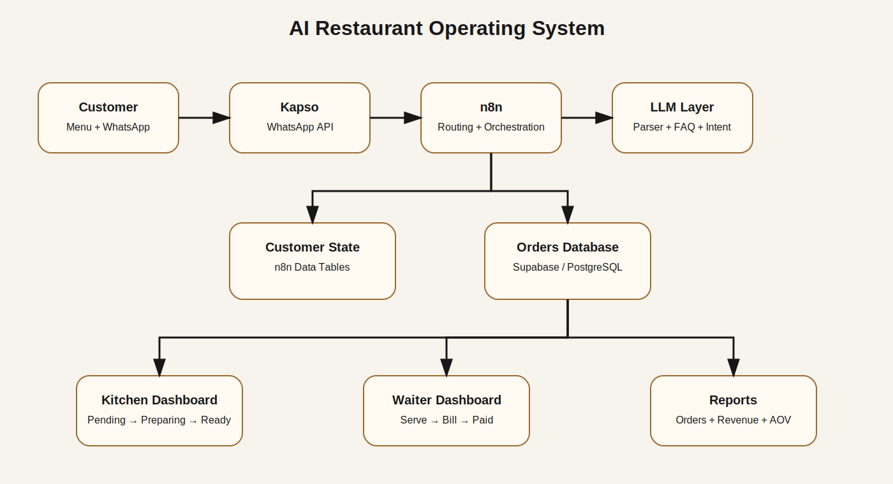
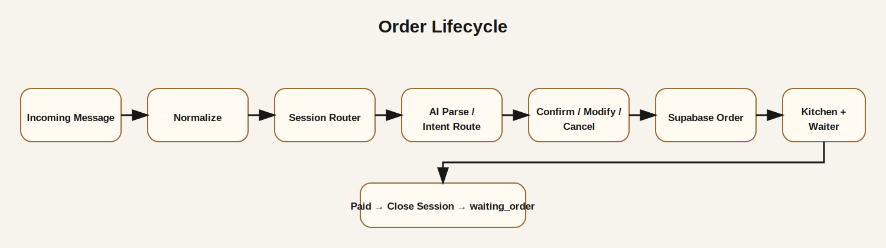

<div align="center">

# 🍽️ AI Restaurant Operating System

### WhatsApp Ordering • AI Routing • Kitchen Operations • Waiter Dashboard • Reports

A working restaurant automation prototype built with **n8n, LLMs, Kapso WhatsApp API, Supabase, JavaScript, and Netlify**.

</div>

---

## Overview

This project connects a customer-facing WhatsApp ordering experience with restaurant operations.

Customers can browse an interactive menu, submit orders through WhatsApp, receive AI-assisted responses, confirm or modify orders, request a waiter, ask for the bill, and complete the order lifecycle. Staff use dedicated kitchen and waiter dashboards, while managers can review operational reports.

> This repository contains a sanitized public portfolio version. Credentials, private URLs, customer data, and production identifiers have been removed.

---

## Main Capabilities

| Area | Capability |
|---|---|
| Customer experience | Interactive digital menu and WhatsApp order handoff |
| AI layer | Intent classification, FAQ handling, and structured order parsing |
| Session management | Customer states such as waiting order, confirmation, modification, cancellation, and active order |
| Kitchen operations | Pending, preparing, and ready order lifecycle |
| Waiter / cashier | Serve order, request bill, payment closure, and service alerts |
| Database | Supabase order storage, order events, and customer session data |
| Reporting | Revenue, order counts, active orders, cancellations, dine-in, takeaway, and average order value |
| Realtime | Dashboard refresh through Supabase realtime events |
| Session closure | Resets the customer to `waiting_order` after payment |

---

## System Architecture



---

## Repository Structure

```text
AI-Restaurant-Operating-System/
├── README.md
├── LICENSE
├── .gitignore
├── docs/
│   ├── ARCHITECTURE.md
│   ├── BUSINESS_FLOW.md
│   ├── SETUP.md
│   └── SECURITY.md
├── images/
│   ├── system-architecture.svg
│   └── workflow-overview.svg
├── screenshots/
│   └── README.md
├── workflows/
│   ├── ai-restaurant-operating-system-public.json
│   ├── close-order-session-public.json
│   └── README.md
└── web-app/
    ├── index.html
    ├── app.js
    ├── styles.css
    ├── _redirects
    └── README.md
```

---

## Core Workflow



1. Kapso receives an incoming WhatsApp message.
2. n8n normalizes the payload and rejects outbound/self-generated messages.
3. The customer record and current session status are retrieved.
4. The message is routed by session state and intent.
5. LLM workflows parse orders, classify requests, or answer menu FAQs.
6. Confirmed orders are written to Supabase.
7. Kitchen and waiter dashboards manage the order lifecycle.
8. After payment, the close-session workflow returns the customer to `waiting_order`.

---

## Technology Stack

- **Automation:** n8n
- **AI / LLM:** OpenAI-compatible models and Gemini through OpenRouter
- **WhatsApp:** Kapso WhatsApp API
- **Database:** Supabase / PostgreSQL
- **Frontend:** HTML, CSS, JavaScript
- **Hosting:** Netlify
- **Integration:** REST APIs, webhooks, JSON, realtime events

---

## Included Workflows

### 1. AI Restaurant Operating System

`workflows/ai-restaurant-operating-system-public.json`

Handles:

- Message normalization
- New and returning customers
- Session routing
- AI order parsing
- FAQ responses
- Order confirmation
- Modification and cancellation
- Waiter alerts
- Bill handling
- Supabase order creation
- Conversation logging

### 2. Close Order Session

`workflows/close-order-session-public.json`

Triggered after payment to reset the customer session for a new order.

---

## Web Application

The `web-app` folder contains:

- Interactive product menu
- Dine-in and takeaway selection
- WhatsApp order generation
- Kitchen dashboard
- Waiter / cashier dashboard
- Reports dashboard
- Supabase realtime updates
- Paid-and-close webhook integration

Configuration placeholders are documented in `web-app/README.md`.

---

## Security Notice

This public version excludes:

- API keys
- Credentials
- Production webhook secrets
- Customer phone numbers
- Private Supabase identifiers
- Internal deployment details

See `docs/SECURITY.md` before using any workflow in another environment.

---

## Project Status

**Working prototype / portfolio project**

The system has been developed and tested as a functional restaurant automation demo. Production deployment would require authentication, row-level security, monitoring, rate limiting, backup policies, and environment-based secret management.

---

## Author

**Badreldin Mohamed Awad**  
AI Automation Engineer | n8n Workflow Architect | Applied AI Systems Builder  
Al Ain, UAE  
Email: [badrna3om@gmail.com](mailto:badrna3om@gmail.com)
