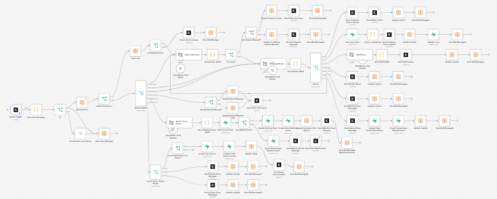

# Architecture

## Components

### Customer Layer
Customers interact through the digital menu and WhatsApp.

### Messaging Layer
Kapso receives and sends WhatsApp messages.

### Automation Layer
n8n manages normalization, state routing, AI calls, validation, database operations, and notifications.

### AI Layer
LLM chains perform:
- Intent classification
- Structured order extraction
- Menu FAQ responses

### Data Layer
- n8n Data Tables store customer state and chat messages.
- Supabase stores orders and order events.

### Operations Layer
- Kitchen dashboard manages pending, preparing, and ready orders.
- Waiter dashboard manages serving, billing, requests, and payment closure.
- Reports dashboard provides operational indicators.

## Session States

The main workflow uses states including:

- `waiting_order`
- `waiting_special_request`
- `waiting_confirmation`
- `modifying_order`
- `order_active`
- `cancellation_requested`

The close-session workflow returns the customer to `waiting_order` after payment.

## Implementation View

