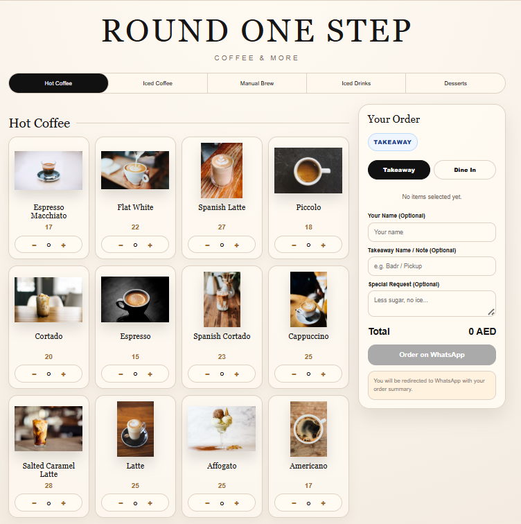
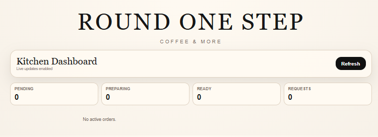
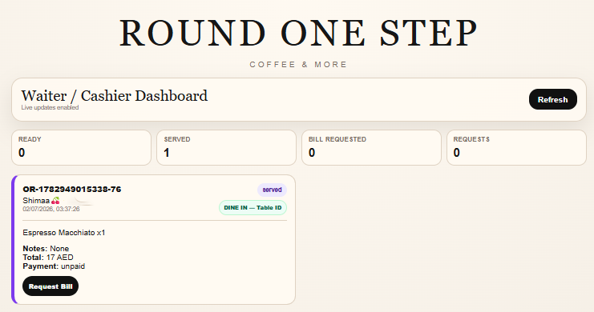
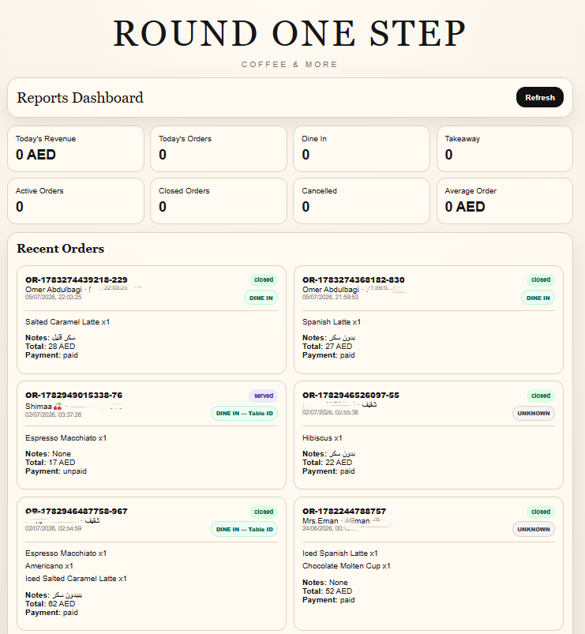

# Business Flow

## New Order

1. Customer opens the menu.
2. Customer selects products.
3. The menu prepares a WhatsApp order message.
4. n8n receives and normalizes the message.
5. AI extracts items, quantities, prices, total, and special requests.
6. The system sends an order summary.
7. Customer confirms, modifies, or cancels.
8. Confirmed order is saved in Supabase as `pending`.

## Kitchen

1. Kitchen sees the pending order.
2. Staff changes it to `preparing`.
3. Staff changes it to `ready`.

## Waiter / Cashier

1. Waiter sees the ready order.
2. Order is marked `served`.
3. Bill is requested.
4. Payment is completed.
5. Order is marked `closed` and `paid`.
6. n8n resets the customer's session to `waiting_order`.

## Service Requests

The AI router recognizes:
- Waiter request
- Bill request
- New order
- Modify order
- Cancel order
- FAQ
- Menu / general conversation

## Interface Examples

### Interactive Menu

### Kitchen Dashboard

### Waiter / Cashier Dashboard

### Reports Dashboard

